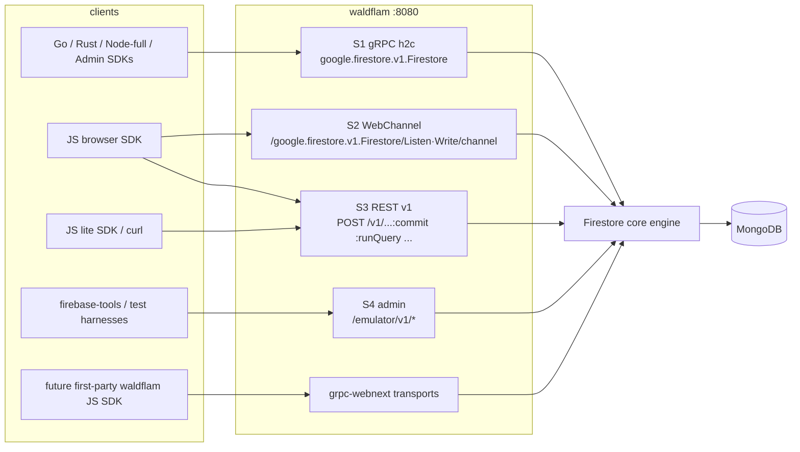

# waldflam — protocol research & architecture

*Protocol research synthesized from the official client SDK sources
(firebase-js-sdk, google-cloud-go/firestore v1.24.0, firestore-rs v0.50.0),
closure-library's WebChannel implementation, the published `google.firestore.v1`
API surface, and grpc-webnext.*

**Status: milestones M0–M6 are implemented and conformance-verified.** §§1–7
are the design and the wire contracts (still the source of truth for
behavior); §8 covers conformance; §9 maps the design onto the code as built;
§10 records what research resolved. Open work lives in
[backlog.md](backlog.md).

## 1. Verdict: yes, do the exact protocol

**Wire-exact Firestore compatibility is feasible, and it is the right call.**
Every official SDK (JS browser, JS Node, Go, Android, iOS, Admin) plus the
de-facto community Rust crate can be pointed at an arbitrary host
**unchanged**, using a supported, documented knob:

| Client | Knob | What goes over the wire |
|---|---|---|
| JS (`firebase/firestore`) | `connectFirestoreEmulator(db, host, port)` or `settings.host` + `ssl:false` | browser: WebChannel + REST-unary, proto3-JSON; Node: gRPC, binary proto |
| Go (`cloud.google.com/go/firestore`) | `FIRESTORE_EMULATOR_HOST=host:port` | gRPC h2c, `authorization: Bearer owner` |
| Rust (`firestore` crate) | `FIRESTORE_EMULATOR_HOST` or `FirestoreDbOptions.firebase_api_url` | gRPC h2c, real ADC bearer token |
| JS lite (`firestore/lite`) | `connectFirestoreEmulator` | plain `fetch()` REST, proto3-JSON |

Nobody else has done this: no mature third-party wire-compatible server
exists. FerretDB (MongoDB wire protocol on Postgres) is
the proven template for the category — waldflam is "FerretDB for Firestore",
ironically storing *into* MongoDB.

Scope honesty: "unchanged" means unchanged **in emulator/custom-host mode**
(plaintext h2c, unverified auth). That is exactly the mode self-hosters need.
A production mode (TLS + verified JWTs) layers on later without protocol changes.

## 2. The four server surfaces

Everything lives on **one plaintext port** (mirroring the emulator, default 8080):



- **S1 — native gRPC (h2c prior-knowledge).** Serves Go, firestore-rs, JS
  Node-full, Admin SDKs, mobile. Tonic server codegen for `google.firestore.v1`
  already exists (`googleapis-tonic-google-firestore-v1` crate), or we vendor
  protos and run tonic-build ourselves. Must tolerate 60 s HTTP/2 keepalive
  PINGs (firestore-rs channels die otherwise) and huge frames (Go raises limits
  to `MaxInt32`).
- **S2 — WebChannel.** The browser JS SDK's streaming transport for `Listen`
  and `Write` only. Google Closure BrowserChannel VER=8: `POST
  /google.firestore.v1.Firestore/{Listen|Write}/channel` (note: **no `/v1`
  prefix**), `gsessionid` stickiness, `database` query param on every request,
  raw proto3-JSON payloads, and — crucially — auth headers arrive **inside the
  handshake POST body** (`encodeInitMessageHeaders`), not as HTTP headers.
  This is the one genuinely bespoke protocol we must reverse; closure-net is
  the client-side reference.
- **S3 — REST v1 unary.** `POST {base}/v1/{resourcePath}:{batchGet|commit|runQuery|runAggregationQuery}`,
  proto3-JSON. The browser full SDK uses this for all unary RPCs (only
  Listen/Write ride WebChannel) and the lite SDK uses it for everything.
  Streaming responses are returned as a **JSON array** of messages. Error body
  shape: `{error: {status: "NOT_FOUND", message}}` with *string* status enums,
  optionally wrapped in a one-element array.
- **S4 — admin API.** `DELETE /emulator/v1/projects/{p}/databases/(default)/documents`
  (clear data — needed by every test harness), rules hot-reload for
  `@firebase/rules-unit-testing`, later `:ruleCoverage`.
- **S5 — grpc-webnext.** See §5. Not required for Firebase-SDK compat; comes
  nearly free and powers a future first-party browser SDK.

Serialization is dual: binary proto on S1, proto3-JSON on S2/S3 (ISO-8601
timestamps with 9-digit nanos, base64 bytes). Define the engine API in terms of
the proto types once; prost gives binary, and a serde mapping (or
`prost-wkt`-style JSON) gives the REST/WebChannel shape. Also: REST clients
strip `database`/`parent` from the body (it's in the URL); gRPC clients include
it — parse both.

## 3. Wire contract — the hard requirements

Condensed from the three SDK deep-dives. These are the things that break
clients if you get them wrong, discovered by reading the client state machines.

### RPC coverage (union across SDKs)

Must implement: `Commit`, `BatchWrite`, `BatchGetDocuments`, `RunQuery`,
`RunAggregationQuery`, `Listen` (bidi), `Write` (bidi), `BeginTransaction`,
`Rollback`, `PartitionQuery`, `ListCollectionIds`, `ListDocuments`,
`GetDocument`, `CreateDocument`, `UpdateDocument`, `DeleteDocument`.
(Go never calls the last four or `Write`; JS never calls `BeginTransaction` —
it does optimistic transactions via `BatchGetDocuments` + preconditioned
`Commit` — but firestore-rs calls *everything*, including bidi `Write`.)
`ExecutePipeline` (JS/Go beta) can wait.

### Documents & names

- Every `Document` ever sent must have **non-nil `create_time` and
  `update_time`** — the Go client nil-panics without them.
- `update_time` must **change on every real write**; Go drops changes with an
  identical `update_time` as no-ops.
- Names are `projects/{p}/databases/{d}/documents/{path}`; default database is
  literally `(default)`. Echo names verbatim — JS hard-fails if the
  project/database segments don't match the client's.
- firestore-rs `ping()` does `GetDocument` on `.../databases/{d}/-ping-` and
  needs **`NOT_FOUND`** back (not `INVALID_ARGUMENT`).

### Listen (the heart of the product)

Three different client state machines, one server behavior satisfies all:

1. Client sends `AddTarget` (Go: always target_id **214**; JS: client-allocated
   even IDs, odd for limbo docs; never reassign, never send an ADD with empty
   `target_ids` — Go indexes `TargetIds[0]` unguarded).
2. Server streams `DocumentChange` for the initial result set (with the
   target id in `target_ids`), then `TargetChange{CURRENT}` for the target,
   then the **global snapshot marker**: `TargetChange{NO_CHANGE, target_ids:
   [], read_time, resume_token}`. Both Go and JS gate snapshot delivery on
   exactly that empty-target_ids NO_CHANGE; without it clients block forever
   and JS flips to Offline after 10 s.
3. Thereafter: doc changes followed by a fresh global NO_CHANGE per consistent
   batch. `DocumentDelete`/`DocumentRemove` for departures.
4. **Resume tokens** are ours to define (opaque bytes); clients replay them on
   reconnect. A stale token must trigger `TargetChange{RESET}` + full
   re-send — never `INVALID_ARGUMENT` (permanently kills firestore-rs
   listeners; terminal in Go too).
5. **Existence filters**: only send them if the `count` is exact — Go ignores
   the bloom filter and force-resyncs on any count mismatch. JS applies the
   bloom filter: MD5 of the full document name, two little-endian u64 halves,
   `hashCount` probes, LSB-first bitmap. Simplest correct v1: don't send
   existence filters at all.
6. Never half-close a Listen stream from the server; EOF is treated as a
   transient error and clients reconnect-loop.
7. `TargetChange{REMOVE}` is fatal to Go clients — only send it with a real
   `cause` when a target is genuinely broken (e.g. rules deny).

### Write stream (bidi)

- First client message is a handshake (`{database}` only). The first response
  **must carry a non-empty `stream_token` and no `write_results`** (JS
  hard-asserts both). Reply immediately — firestore-rs blocks on it.
- Every response carries `stream_token`; `commit_time` required whenever
  `write_results` is non-empty. Clients echo the token; **`stream_id` is never
  sent — don't require it.** JS keeps ≤10 batches in flight.

### Queries

- `RunQuery` responses stream until **server half-close**; Go never reads
  `done` and would hang without EOF. Responses without a document (progress /
  `read_time`-only) are skipped by clients, so they're safe to send.
- The server must apply Firestore's **implicit `__name__` tiebreak** (direction
  of the last explicit order-by) even when the wire query has no `__name__`
  order — the Go watch comparator assumes it, and wrong order corrupts
  snapshot indices.
- Full cross-type value ordering (from Go `order.go`): Null < MinKey < Boolean
  < Number (NaN below all) < Timestamp < String < Blob < Reference (compared
  path-segment-wise) < GeoPoint < Array < Vector < Map < MaxKey. This ordering
  must be encoded into the Mongo index representation (§6).
- `limitToLast` is client-side (flipped orders + reversed results) — we only
  need correct DESC + cursors. `__name__` cursor values arrive as
  `reference_value` full resource names.
- `BatchGetDocuments`: **exactly one** `found`/`missing` response per distinct
  requested name — a missing answer hangs Go ("documents not received"), a
  duplicate is fatal ("seen twice"). Order doesn't matter.
- Aggregations: echo the client's aliases exactly (`aggregate_0`, …); JS
  asserts exactly one response carries `aggregate_fields`.

### Transactions & errors

- `BeginTransaction`/`Commit(transaction)`/`Rollback` with
  `ReadWrite.retry_transaction` echoing the previous txn id on retry.
- Contention must surface as **`ABORTED`** — it is the *only* code that
  triggers transaction retry in Go and firestore-rs.
- `Commit` may arrive with zero writes (read-only RW txn) — return
  `commit_time` and empty results.
- JS transactions rely on `Write.current_document` preconditions
  (`exists`/`update_time`) and `VerifyMutation` (`verify` field) — enforce them
  precisely.
- Code taxonomy that clients act on: `NOT_FOUND` (missing doc / ping),
  `ALREADY_EXISTS` (create collision), `ABORTED` (contention),
  `FAILED_PRECONDITION` (precondition failed; terminal), `PERMISSION_DENIED`
  (rules; terminal), `UNAVAILABLE`/`RESOURCE_EXHAUSTED`/`INTERNAL` (transient;
  note `RESOURCE_EXHAUSTED` sends Go/JS straight to max backoff).
- `BatchWrite` responses: `status[]` and `write_results[]` must both be exactly
  request-length and request-ordered (Go indexes them in lockstep).

### Headers & auth

Tolerate and mostly ignore: `google-cloud-resource-prefix`,
`x-goog-request-params` (shape differs per SDK, may legally appear **twice** on
one call from Go, absent entirely on Listen/Write — route off the request body,
not headers), `x-goog-api-client`, `x-goog-api-key`, `x-firebase-gmpid`,
`x-firebase-appcheck`, `?key=` query param.

Auth reality per client in emulator mode: Go sends `Bearer owner` (admin
bypass); browser JS sends **no Authorization header at all** unless
`mockUserToken` is set (then an unsigned `alg:none` JWT); firestore-rs sends a
*real Google ADC token* for some unrelated project. Policy engine (semantics
specified in §11, implemented in
`waldflam-server/src/auth.rs`): `Bearer owner` case-insensitively ⇒ admin,
bypasses rules entirely; any other bearer must be an **unsigned JWT**
(`alg: "none"`, empty signature) whose claims are decoded but never verified —
`request.auth.uid` = the `sub` claim, `request.auth.token` = the whole payload
verbatim; absent header ⇒ `request.auth == null`; malformed ⇒
`INVALID_ARGUMENT`. The `google-cloud-resource-prefix` header *overrides* the
database inferred from the request body and is the only way to route
`Listen`/`Write` streams. Signature verification (against Firebase Auth JWKS
or a configured issuer) becomes an opt-in production mode later.

## 4. What clients do NOT need (scope savings)

- **`firestore.indexes.json` enforcement.** The emulator "executes any valid
  query" without indexes. We parse the file, use it to build Mongo indexes and
  collection-group indexes (§6), but never reject an unindexed query in v1.
- **Existence filters / bloom filters** — optional server feature; skip in v1.
- **`ExecutePipeline`**, `PartitionQuery` beyond a stub (single partition is a
  legal response and the Go client short-circuits `partitionCount==1` anyway).
- **REST for Listen** — no client uses it; JS lite has no realtime at all.
- **gRPC-Web / Connect** — no Firebase client speaks them; not on any path.

## 5. grpc-webnext's role

grpc-webnext's Rust in-process mode wraps tonic `Routes` and passes
`application/grpc` traffic through **untouched** — so mounting waldflam's S1
service inside it costs nothing and adds, on the same port: browser-capable
full-bidi gRPC (h2ts WebSocket tunnel), the Frame protocols, and
`google.api.http` REST transcoding. That makes a future *first-party* waldflam
browser SDK (JS/WASM) trivial — real gRPC `Listen` in the browser, no
WebChannel archaeology.

It does **not** replace S2: the Firebase JS SDK speaks Closure WebChannel and
nothing else. WebChannel must be implemented regardless if unchanged
`firebase/firestore` browser clients are a goal (they are — it's the flagship
compat story). Sequencing: S1 first (three SDKs light up), S3 next (lite +
browser unary), S2 after (browser realtime), S5 whenever.

## 6. Storage on MongoDB

Single flat collection per Firestore database, as sketched in the readme:

```
_id:            "users/alice/posts/p1"          // full doc path, / separated
$indexedFields: { "author": {...}, "tags": [...] }   // order-preserving encoded values
$payloadFields: <BSON of the non-indexed remainder>
createTime:     <BSON date or timestamp>
updateTime:     <monotonic per-doc version — also the MVCC clock>
```

Design notes (to be turned into a detailed design doc before M1):

- **Type-ordered encoding.** Firestore's cross-type ordering (§3) does not
  match BSON's comparison order, so `$indexedFields` stores an
  **order-preserving encoding**. §11 specifies the format: an ordered-number
  byte encoding that interleaves int64 and double in ≤11
  prefix-free bytes (sentinels: NaN `00 60` < −∞ `00 80` < … < 0 `80` < … <
  +∞ `FF`; negatives are the bitwise complement of their magnitude's encoding,
  DESC columns the complement of ASC), integral doubles are canonicalized to
  int64 in index space (`1.0 == 1`), index values are truncated at **1500
  bytes** with a `truncated` flag as final tiebreaker, and inequality filters
  are **type-bounded ranges** (category min/max per type; NaN is a sub-bottom
  below −∞, so `>= -inf` matches all numbers but not NaN; `EQ null` is
  rewritten to an unsatisfiable filter — only `UnaryFilter IS_NULL` matches
  nulls). The comparator half is already implemented and tested in
  `waldflam-engine/src/order.rs`; the byte encoding is next.
  One Mongo-specific trap discovered: **BSON BinData compares length-first**,
  so raw variable-length memcomparable bytes cannot be indexed as BinData.
  Store the key as a BSON *string* in an order-preserving byte-safe alphabet
  (hex is monotone and trivially correct; optimize later), or design
  fixed-width keys.
- **Collection targeting.** Queries filter by parent path + collection id.
  Store `parent` ("users/alice/posts" → parent path) and `collectionId`
  ("posts") as top-level fields; collection queries are
  `{parent: X, collectionId: Y}`, collection-group queries are
  `{collectionId: Y}` + optional path-range for `parent` scoping — the latter
  gated on a declared collection-group index (matching Firebase semantics from
  the readme), which maps to a Mongo compound index
  `{collectionId, "$indexedFields.<field>"}`.
- **`__name__` tiebreak** comes free by appending `_id` to every Mongo sort.
- **Transactions & read_time.** Mongo multi-document transactions (requires
  replica set — run `mongod --replSet` even single-node; document this) give
  atomic `Commit`. Snapshot read concern + `$clusterTime` supplies a
  serializable `read_time`; `BeginTransaction` ids map to server-held sessions
  with expiry, and write-conflict → `ABORTED`.
- **Listen backbone: Mongo change streams** on the flat collection, filtered
  server-side per target, with waldflam-defined resume tokens wrapping Mongo's
  change-stream resume tokens + a query fingerprint. Change streams also
  require the replica set, so that's a hard deployment prerequisite anyway.
- **Precondition & transform writes** (`serverTimestamp`, `increment`,
  `max/min`, `arrayUnion/arrayRemove`) are single-doc read-modify-write inside
  the commit's transaction; `transform_results` returned positionally.

## 7. Security rules engine

Implement the language from its specification. Prior open-source attempts at
a rules parser predate `rules_version = '2'` (modern files fail on line 1),
bake inverted operator precedence into an ANTLR grammar, and lack
short-circuit `&&`/`||` — so the canonical `request.auth != null && ...`
throws instead of denying. The load-bearing details they get wrong are worth
knowing about: `{seg}`/`{seg=**}` path-pattern semantics, reserved words
usable as identifiers, and short-circuit behavior.

Fresh Rust implementation against the rules-language semantics specified in
§11. The load-bearing behaviors to implement exactly:

- **Errors are values, not exceptions.** An error becomes an `undefined` value
  that poisons most operations, but `&&`/`||` can *absorb* it: `<err> || true`
  → `true`, `<err> && false` → `false`, while `<err> || false` and
  `<err> && true` stay errors. Short-circuit jumps happen only left-to-right
  (`true || <rhs>` never evaluates rhs). At the rule level, sibling `allow`
  statements combine as ternary-OR: any `true` rescues an erroring sibling;
  empty allow list ⇒ deny; final non-bool ⇒ error ⇒ deny.
- **Type system**: int64 ≠ float with **int→float as the only coercion in the
  language**; cross-type `==` is `false` (not an error) but cross-type `<` is
  an error; `NaN != NaN`; `null.field` errors; `map.missing` is undefined (not
  null). Types: bool, int, float, string, null, timestamp, duration, latlng,
  path, list, map (+ `constraint` for query/list authorization). Integer
  overflow is an error, never a wrap.
- **Path matching**: v1 glob `{x=**}` must be terminal and matches ≥1 segment;
  v2 glob matches ≥0 segments, may have trailing segments, max one per path.
  `read` expands to get/list, `write` to create/update/delete, one level only.
- **Limits** (compile: expression depth 100, match depth 10, function-call
  depth 20 with recursion banned outright; runtime: 10 000 instruction budget,
  1 MiB value-stack, 10 s CPU) and **lookup budgets**: 20 `get()`/`exists()`
  backend calls per request, 10 cache-misses per entity authorized, memoized
  per-request cache keyed by document ref; `get()` of the doc under
  authorization is free.
- `matches()` is RE2 (`regex` crate is compatible); pattern limits: ≤4096
  chars, ≤100 groups, nesting ≤20.
- Query (`list`) authorization evaluates `resource.data.x` as **constraint
  values** derived from the query's filters — implication checking, not
  document evaluation.

Rules apply to client traffic only; `Bearer owner` bypasses, mirroring the
emulator. Architecture seam worth copying: the language core is
service-agnostic (variables and `get()`/`exists()` are injected per context),
with the Firestore binding as a separate layer — keep `waldflam-rules` free of
engine dependencies.

## 8. Conformance strategy

Correctness is defined by *official clients working unchanged*, not by our own
tests agreeing with themselves. Seven suites run against a single live server
(`conformance/`), each driving a real SDK over its real transport:

| Suite | Client | Transport | Covers |
|---|---|---|---|
| `conformance/go` | `cloud.google.com/go/firestore` | gRPC h2c | CRUD, transforms, preconditions, queries, `GetAll`, `RunTransaction` (incl. concurrent contention), `Collections`/`DocumentRefs`, `Select`, `Snapshots`, aggregations |
| `conformance/rust` | `firestore` crate | gRPC h2c | ping, CRUD, `ALREADY_EXISTS`, queries, transactions, streaming batch writer (bidi Write) |
| `conformance/js` `main.mjs` | `firebase` (Node build) | gRPC | set/get, `increment`/`serverTimestamp`, queries, count, optimistic transactions, `onSnapshot` |
| `conformance/js` `lite.mjs` | `firebase/firestore/lite` | `fetch()` REST | set/get, transforms, queries, count, delete |
| `conformance/js` `browser.mjs` | `firebase` (browser build) | WebChannel + REST | the full suite over the closure wire protocol |
| `conformance/js` `rules.mjs` | `firebase` + admin API | mixed | admin bypass, anonymous/owner allow+deny, `exists()` in rules, `list` enforcement, clear-data |
| `conformance/js` `triggers.mjs` | `firebase` + local HTTP runtime | mixed | create/update/delete CloudEvents, before/after payloads, path params, non-matching paths |

Run them with a server up (`docker compose up -d && cargo run --bin waldflam`);
each prints `ALL … CHECKS PASSED`. Plus `cargo test --workspace` for the unit
layer — value ordering, index encodings, rules semantics, resource names, auth,
trigger patterns.

Still worth adding (see backlog): pointing the SDKs' *own* upstream integration
suites at waldflam, and differential testing against test vectors derived from
the official emulator.

## 9. Implementation map

Where the design lives in the code:

| Concern | Module |
|---|---|
| Proto/gRPC codegen + descriptor set | `crates/waldflam-proto` (`build.rs` emits both) |
| Value total order (§3, §11) | `waldflam-engine/src/order.rs` |
| Ordered-number byte encoding (§6) | `waldflam-engine/src/encoding.rs` |
| Whole-value index keys, hex wrapper | `waldflam-engine/src/index_key.rs` |
| Resource names / path parity | `waldflam-engine/src/path.rs` |
| Mongo storage, index entries | `waldflam-engine/src/store.rs` |
| Commit: preconditions, masks, transforms, one Mongo transaction per batch | `waldflam-engine/src/commit.rs` |
| Query evaluation, aggregations | `waldflam-engine/src/query.rs` |
| Filter + sort/limit pushdown into Mongo | `waldflam-engine/src/plan.rs` |
| Transactions (optimistic read-set) | `waldflam-engine/src/txn.rs` |
| Commit-event hub (watch + triggers) | `waldflam-engine/src/watch.rs` |
| Cross-instance commit fan-out (change stream) | `waldflam-engine/src/fanout.rs` |
| Rules language (lexer/parser/eval/stdlib) | `crates/waldflam-rules` |
| gRPC service (S1) | `waldflam-server/src/service.rs` |
| Listen watch state machine | `waldflam-server/src/listen.rs` |
| Bidi Write stream | `waldflam-server/src/write_stream.rs` |
| REST v1 + admin API (S3, S4) | `waldflam-server/src/rest.rs` |
| WebChannel (S2) | `waldflam-server/src/webchannel.rs` |
| Rules binding + enforcement | `waldflam-server/src/rules.rs` |
| Trigger registry + dispatcher | `waldflam-server/src/functions.rs` |
| Emulator-mode auth | `waldflam-server/src/auth.rs` |

Four things the design didn't anticipate, three found by running real clients
and one by measuring query plans:

1. **The JS full SDK reads single documents via `Listen`, not
   `BatchGetDocuments`, and writes via the `Write` stream, not `Commit`.**
   Enforcement (rules) and any per-operation policy must live on the streaming
   paths too — covering the unary RPCs alone leaves `getDoc`/`setDoc`
   completely unguarded.
2. **Browser clients put `Authorization` in the WebChannel handshake *body***
   (the `encodeInitMessageHeaders` block), not in HTTP headers, to keep
   requests CORS-simple. Auth extraction is per-surface.
3. **Mongo compares BSON `BinData` by length first**, so variable-length
   memcomparable keys cannot be stored as binary; index keys are lowercase-hex
   strings, which compare bytewise.
4. **Sort keys have to be stored fields, and the tiebreak has to be a
   regular column.** §6 planned `$indexedFields` as a per-field object; the
   first build used one array of `{p, k, v}` triples, which indexes and
   filters well but can never order — MongoDB sorts from an index only on a
   stored path, and a value inside an array isn't one. Extracting it per
   query with `$addFields` produced correct pages via a blocking top-K sort,
   never an index-ordered one.

   As built (`store.rs`): a nested `keys` mirror of the document's fields,
   each node holding its own key under the reserved `__val__` sentinel — a
   map needs to carry both its own value and its children, and
   `keys.meta` cannot be a string and a subdocument at once. A **wildcard**
   index over `keys` keeps this automatic for schemaless documents, with two
   measured constraints shaping the rest:

   - A wildcard component serves a sort only if the query also *bounds* that
     path. `$exists: true` does not qualify; a range does. Firestore already
     requires order-by fields to exist, so the existence clause and the bound
     are the same clause.
   - It serves a sort on only one wildcard field — but a trailing *regular*
     column is allowed. `__name__` is Firestore's implicit tiebreak on every
     order-by, so storing it as top-level `name_key` makes
     `{scope, keys.$**, name_key}` cover `ORDER BY <any field>, __name__`
     without a blocking sort.

   The remaining ceiling is unchanged: one field path binds per index scan,
   so a second filter contributes no selectivity, and a query whose
   normalized order-by has three or more columns falls back to a top-K sort.
   True composite indexes need one key per query shape — precisely why
   Firestore has users declare them while single-field indexing stays
   automatic. Tracked in [backlog.md](backlog.md).

## 10. Questions research resolved

1. **Order-preserving encoding** — resolved: Google's ordered-number format
   (§6, §11), reimplemented in `encoding.rs`, wrapped per-type in
   `index_key.rs`, stored as hex strings because BSON BinData sorts
   length-first. Verified by pairwise comparison against the semantic
   comparator across the full type matrix.
2. **Rules: own engine vs a CEL crate** — resolved in favor of hand-rolling.
   The `match {}` layer, path literals with `$()` splices, `x is T`, async
   `get()`/`exists()` with budgets mid-expression, and the error-absorption
   semantics are all outside what a CEL library provides; and owning the
   parser means upstream churn can't move our semantics. §7 is the spec,
   `crates/waldflam-rules` the implementation.
3. **Trigger delivery model** — resolved: subscribe to the same commit hub
   that powers Listen (so every write surface fires triggers for free) and
   deliver CloudEvents 1.0 over HTTP.
4. **Rules `map.keys()`/`values()` ordering** is unspecified upstream; we use
   sorted-key order deliberately — a documented, intentional divergence.

Everything still open — `read_time` consistency, PartitionQuery,
firebase-tools integration, production auth — is tracked in
[backlog.md](backlog.md).

## 11. Behavior contracts

The specifications waldflam must match exactly for clients to behave
correctly. Referenced throughout §§3, 6, and 7.

**Values, indexes, queries.** The cross-type value ordering and the
order-preserving number index encoding; index-value truncation at 1500 bytes
with a `truncated` tiebreaker; category-bounded inequality ranges; implicit
order-by normalization — append inequality fields sorted by path, then
`__name__`, all in the last explicit direction.

**Writes.** Precondition enforcement and its error codes (document versions
are microsecond timestamps; contention ⇒ `ABORTED`). Transform semantics:
saturating integer `increment`, NaN-aware `max`/`min`, array union/remove
compared by *index value* so `1` dedupes against `1.0`, transform results
positional with `null` for array ops, and one shared `request_time` per
commit.

**Names and limits.** Resource-name grammar; path ≤ 100 segments; ids ≤ 1500
bytes UTF-8; document ≤ 1 MiB; map depth 20 (50 counting arrays); `__.*__`
reserved except for sentinel-typed maps.

**Rules, auth, transport.** The rules-engine semantics in §7; auth handling in
§3; the gRPC↔HTTP status mapping and JSON error envelope; single-port
multiplexing (sniff the first 24 bytes for the HTTP/2 preface to tell gRPC
from HTTP/1.1).

**Where §3's client contracts are the only authority.** WebChannel, the
`/emulator/v1` admin surface, REST v1, Listen resume tokens and existence
filters, aggregations, `IN`/`NOT_IN`/`!=`/`array-contains-any`/`OR` filters,
multi-inequality queries, named databases, and `bytes`/`hashing.*`/
`map.diff()`/`debug()` in rules. For all of these, implement what the client
state machines in §3 require.

**Implementation notes.**

- Watch `read_time`s must be strictly monotonic — force +1µs on collision.
- A legitimate fallback for query watches is RESET + a full re-run per
  affected commit.
- `Commit` must populate `commit_time` and `write_results` (§3).
- Document size and depth limits are ours to enforce, using the constants
  above.
